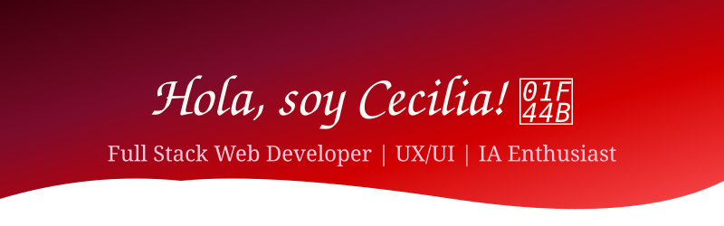

  

<h3 align="center">Transformando ideas en experiencias web dinámicas e intuitivas ✨</h3>

  <em>Desarrollo, diseño, tecnología e inteligencia artificial con propósito.</em>

 

  Disfruto de todo el proceso creativo, desde la primera idea hasta el producto final.
  Me encanta aprender, experimentar y mantenerme siempre actualizada, especialmente
  en un ecosistema que cambia tan rápido como el desarrollo web.

  Pongo mi stack, mi energía y mi compromiso a disposición de cada proyecto.
  Me adapto fácilmente al trabajo en equipo, pero también soy muy autogestionable
  cuando toca avanzar por cuenta propia.
  Y, dato de color: <strong>no tengo miedo a aparecer frente a una cámara</strong>. 🎥

  También disfruto muchísimo compartir lo que sé y acompañar a otras personas
  en sus primeros pasos dentro de la programación.

  <strong>
    Creo que los mejores productos nacen cuando hay un propósito claro,
    un gran equipo y, obvio, un par de risas en el medio.
  </strong> 🚀

 

  

  

  

 

---

## 🎯 Stack tecnológico

 

---

## ⚡ Skills destacados

* 🎨 **UX/UI:** Diseño centrado en las personas, usabilidad e interfaces eficientes, respaldado por la **Diplomatura en Desarrollo Web UX/UI de UTN.BA**.

* 🚀 **Gestión de proyectos ágiles:** Aplicación de metodologías ágiles, organización de proyectos y trabajo colaborativo.

* 🤖 **IA aplicada al desarrollo:** Uso avanzado de herramientas de inteligencia artificial orientadas al desarrollo frontend, incluyendo **Claude Code** y **Antigravity**.

* 👩‍🏫 **Docencia y mentoría:** Enseñanza de programación e incorporación de metodologías de aprendizaje asistidas por IA.

* 💡 **Resolución de problemas:** Capacidad para transformar necesidades e ideas en soluciones digitales funcionales, intuitivas y escalables.

---

## 🧠 Actualmente

**Frontend · Full Stack · UX/UI · IA aplicada · Docencia**

 

`Construir` → `Aprender` → `Compartir` → `Iterar`

 

  

