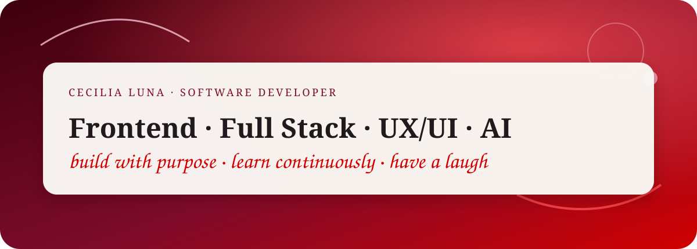
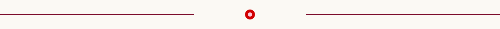
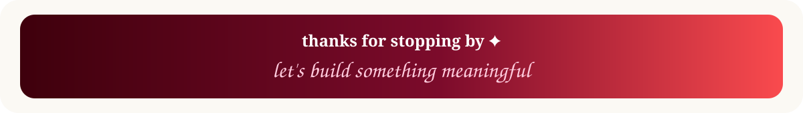

  

  
  

  <i>Desarrollo productos digitales con una mezcla bastante deliberada de código, UX/UI, IA y curiosidad.</i>

---

## ✦ Sobre mí

Disfruto de todo el proceso creativo de principio a fin y me encanta estar siempre aprendiendo y actualizándome. Pongo todo mi stack, mi energía y mi compromiso a disposición del equipo porque amo sentir que cada paso tiene un sentido real.

Me adapto súper fácil a las dinámicas grupales, pero también soy bastante autogestionable y —dato de color— ¡no tengo miedo a aparecer en cámaras, ja!

Por último, me apasiona compartir lo que sé, y tengo una convicción muy clara: los mejores productos nacen cuando hay un propósito claro, un gran equipo y, obvio, un par de risas en el medio.

### Actualmente, mi foco está en combinar

<table>
  <tr>
    <td width="50%">⚡ <strong>Desarrollo</strong> Frontend y Full Stack con JavaScript, React, Next.js, Node.js y Express.js.</td>
    <td width="50%">✦ <strong>Producto</strong> UX/UI, arquitectura de información, usabilidad y rendimiento.</td>
  </tr>
  <tr>
    <td width="50%">◈ <strong>IA aplicada</strong> Prompt Engineering, Claude Code y Antigravity como herramientas de desarrollo.</td>
    <td width="50%">↗ <strong>Personas</strong> Docencia, mentoría y acompañamiento en procesos de aprendizaje IT.</td>
  </tr>
</table>

---

## ⚙️ Stack tecnológico

  
  
  
  
  

  
  
  
  
  
  

---

## 🧠 Skills

| Área | Qué aporto |
|---|---|
| **Desarrollo Web Full Stack** | Creación de aplicaciones web completas en frontend y backend, con foco en JavaScript y React (nivel avanzado). |
| **UX/UI** | Diseño centrado en el usuario, usabilidad e interfaces eficientes, respaldado por formación específica en UX/UI. |
| **Agile Management** | Aplicación de metodologías ágiles, marcos de trabajo y organización de equipos. |
| **Prompt Engineering + IA** | Uso avanzado de IA orientada al desarrollo frontend y de herramientas de programación asistida como Claude Code. |
| **Docencia + Mentoría** | Enseñanza de introducción a la programación, acompañamiento técnico y uso de IA aplicada a la comprensión práctica. |

---

## 🎓 Certificaciones

<strong>2026 · IA + Frontend</strong>

**🤖 Claude Code**  
Rolling Code School · `#Rolling Certified Professionals`  
**Julio de 2026**

**💻 Prompt Engineering para desarrolladores FrontEnd**  
UTN.BA · Centro de e-Learning, Facultad Regional Buenos Aires  
82 horas · **Nota: Excelente** · **Febrero de 2026**

<strong>2025 · UX/UI</strong>

**🎨 Diplomatura en Desarrollo Web UX/UI**  
UTN.BA · Centro de e-Learning, Facultad Regional Buenos Aires  
105 horas · **Nota: Sobresaliente** · **Septiembre de 2025**

<strong>2024 → 2022 · Gestión + Desarrollo</strong>

**🚀 Diplomatura Universitaria en Agile Management**  
Agencia I + UTN TUC · Facultad Regional Tucumán, Universidad Nacional de Tucumán  
130 horas teórico-prácticas (4 meses) · **Julio de 2024**

**⚛️ JavaScript / React — Nivel Avanzado**  
Global Learning Digital Empowerment · Yerba Buena / Clúster Tecnológico Tucumán  
**2023**

**🛠️ FullStack Web Developer**  
Rolling Code School  
**Febrero – Octubre de 2022**

---

## 💼 Experiencia profesional

### Fundación Valores Para Mi Ciudad
**Programadora Full Stack · marzo 2026 – Presente**

- Desarrollo de la página web institucional utilizando React Vite y herramientas de Inteligencia Artificial (Antigravity CLI).
- Diseño de la experiencia de usuario (UX/UI) y optimización en la estructuración de la información de la organización.
- Implementación de métodos sencillos de contacto directo (WhatsApp) y donaciones a pedido del cliente.

### Bless Inmobiliaria
**Programadora Full Stack · febrero 2026 – Presente**

- Desarrollo integral de la web institucional y del sistema de gestión interno con su backend y API REST propia.
- Gestión de la plataforma para el control de publicaciones de propiedades y canales de contacto de los agentes inmobiliarios, utilizando el stack completo de desarrollo, React Vite y asistencia de agentes de IA (Antigravity).
- Creación y diseño del flujo UX/UI completo del sistema.

### SIGMMA.net
**Desarrolladora de Front-end · mayo 2024 – Presente**

- Desarrollo de una aplicación web para clientes de las agencias integradas a SIGMMA, permitiendo la gestión autónoma de pagos, estados de cuenta y creación de usuarios desde backoffice y plataforma, con múltiples pasarelas de pago: Mercado Pago, Macroclick, Modo y Bancard.
- Creación de la nueva web institucional en Next.js junto a equipos de diseño UX/UI, integrando una calculadora de fuga basada en parámetros personalizados y automatizaciones con GoHighLevel.
- Enfoque especializado en SEO, incluyendo optimizaciones para motores de búsqueda basados en IA, y rendimiento web.
- Desarrollo de una plataforma de academia con React Vite, Express.js, Node.js y Claude Code, con diseño UX/UI propio utilizando Claude Design, para capacitar y certificar agencias según sus planes contratados.
- Participación temporal en la planificación estratégica de un nuevo sistema de autogestión en Next.js.

### Iglesia de Cristo Tucumán
**Desarrolladora Front-end · noviembre 2025 – Presente**

- Desarrollo de la interfaz web institucional bajo parámetros de diseño UX/UI alineados con la identidad de proyectos previos, enfocada en la difusión informativa de la institución y sus creencias.

### Instituto NOA San Miguel de Tucumán
**Profesora · agosto 2025 – Presente**

- Impartición de clases de introducción a la programación (HTML, CSS y JavaScript).
- Combinación de teoría fundamental con recursos audiovisuales y espacios de mentoría sobre el ecosistema IT, el mercado laboral y el uso intensivo de herramientas de Inteligencia Artificial aplicadas a la comprensión teórica y práctica.

### CONTI Latam®
**Desarrolladora de Front-end · noviembre 2024 – diciembre 2025**

- Desarrollo de interfaces y soluciones frontend orientadas a los proyectos tecnológicos de la compañía.

### La Quiaqueña Drugstores
**Desarrolladora Web · julio 2022 – febrero 2023**

- Creación de una página web de comercio electrónico para una cadena de drugstores, facilitando la compra en línea y la comunicación directa vía WhatsApp.
- Primer proyecto desarrollado de forma independiente abarcando tanto el Frontend como el Backend, consolidando la experiencia profesional inicial en el desarrollo web.

---

## 🧩 Lo que me define técnicamente

  
  
  
  
  

> **Mi idea de un buen desarrollo:** tecnología que resuelve, diseño que se entiende y un equipo que puede disfrutar el proceso.

---

## 🎥 Caso de éxito

  

  <a href="https://www.youtube.com/watch?v=4pwIPI3ecD8&t=231s">
    Entrevista en Rolling Code como caso de éxito
  </a>

---

  

